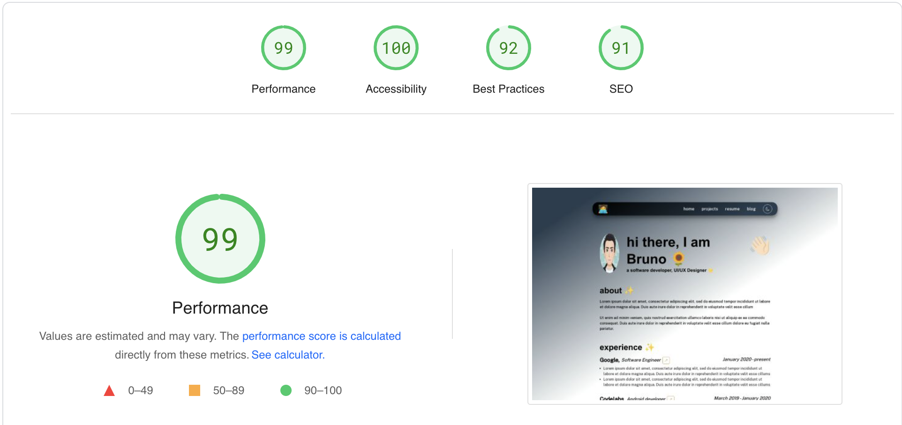

# Minimalist Developer Portfolio 🚀

### A lightweight, customizable and open-sourced minimalist developer personal portfolio built with Next.js. ✨

[add video presentation]

Go to `src/data` folder and replace the data with your personal information, that's it. As simple as that.


## Features ✨

⚡️ Built using Next.js + Styled with Chakra UI 💫

⚡️ Minimalist UI Design + Reveal Animations 🌟

⚡️ Multi Page 💎

⚡️ Fully Responsive 🚀

⚡️ Fast and Optimized for SEO ⚡

⚡️ Support Dark and Light mode 🌙

## Current Lighthouse Performance ⚡



### To view the demo: [Click Here](https://minimalist-dev-portfolio.vercel.app/)

## Getting Started 🚀

The instructions provided here will get you a copy of this template that you can run live on the localhost and do changes and testing according to your need in the development server.

For **Hosting** the project live, you can use any deployment service like netlify, vercel, etc.

This is a [Next.js](https://nextjs.org/) project bootstrapped with [`create-next-app`](https://github.com/vercel/next.js/tree/canary/packages/create-next-app).

### Prerequisites

You'll need Git and Node.js (which comes with NPM) installed on your computer.

```
node@v16.4.2 or higher
npm@7.18.1 or higher
git@2.30.1 or higher
```

### To learn more about Next.js, take a look at the following resources:

- [Next.js Documentation](https://nextjs.org/docs) - learn about Next.js features and API.
- [Learn Next.js](https://nextjs.org/learn) - an interactive Next.js tutorial.

## How To Use 🔧

From your command line, first clone `minimalist-dev-portfolio`.

```bash
# Clone this repository
$ git clone https://github.com/janvi01/minimalist-dev-portfolio.git

# Go into the repository
$ cd minimalist-dev-portfolio

# Remove current origin repository
$ git remote remove origin
```

<br/>

Then you can install the dependencies using `npm` or `yarn`.

Using NPM:

```bash
# Install dependencies
$ npm install

# Start the next.js development server
$ npm run dev
```

**NOTE**:
If your run into issues installing the dependencies with NPM, use this below command:

```bash
# Install dependencies with all permissions
$ sudo npm install --unsafe-perm=true --allow-root
```

Once your server has started, go to this url `http://localhost:3000/` to see the portfolio locally.

<br>

---

<br>

## Template Instructions:
